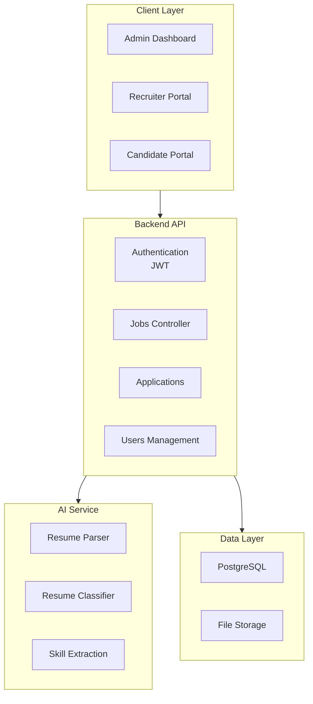

<p align="center">
  <h1 align="center">QUẢN TRỊ DỰ ÁN PHẦN MỀM</h1>
  <h2 align="center">HỆ THỐNG TUYỂN DỤNG TRỰC TUYẾN VỚI AI</h2>
  <p align="center">
    
    
    
  </p>
</p>

---

## 📋 Mục lục

- [Giới thiệu](#-giới-thiệu)
- [Tính năng](#-tính-năng)
- [Kiến trúc hệ thống](#-kiến-trúc-hệ-thống)
- [Công nghệ sử dụng](#-công-nghệ-sử-dụng)
- [Cấu trúc thư mục](#-cấu-trúc-thư-mục)
- [Cài đặt & Chạy](#-cài-đặt--chạy)
- [API Documentation](#-api-documentation)

---

## 🎯 Giới thiệu

Hệ thống tuyển dụng trực tuyến đa vai trò, cho phép HR đăng tuyển, ứng viên apply việc, và tích hợp AI để phân tích hồ sơ ứng viên.

### Đối tượng người dùng
- **HR/Recruiter**: Đăng tuyển, xem ứng dụng, quản lý việc làm
- **Candidate**: Xem danh sách việc, submit ứng dụng, lưu việc yêu thích
- **Admin**: Quản lý toàn hệ thống

### Mục tiêu
- Tích hợp Resume Parsing & Analysis đánh giá chất lượng CV
- Dashboard trực quan cho HR ra quyết định
- Quản lý toàn vòng tuyển dụng: posting → apply → review

---

## ✨ Tính năng

### Recruiter Panel
- Đăng tuyển việc làm chi tiết
- Xem danh sách ứng viên apply cho job
- Quản lý danh sách việc đã đăng
- Xem hồ sơ ứng viên (profile + CV)

### Candidate Portal
- Xem danh sách job tuyển dụng
- Tìm kiếm job theo từ khóa
- Lưu job yêu thích
- Submit ứng dụng kèm CV/Resume
- Cập nhật hồ sơ cá nhân (skills, experience)

### Admin Dashboard
- Quản lý users (recruiter, candidate, admin)
- Xem thống kê tổng quan
- Duyệt nội dung nếu cần

### AI Resume Analysis (rsparser)
- Phân tích resume bằng mô hình classify
- Trích xuất skills từ CV
- Đánh giá chất lượng CV

---

## Kiến trúc hệ thống



---

## Công nghệ sử dụng

<table>
<tr>
<td valign="top" width="50%">

### Frontend
- **React 18+** + Vite
- **Axios** HTTP client
- **CSS** (custom styling)
- **React Router** navigation
- **JWT** authentication

</td>
<td valign="top" width="50%">

### Backend
- **Node.js + Express.js**
- **PostgreSQL** database
- **JWT** authentication
- **Multer** file upload
- RESTful API

</td>
</tr>
<tr>
<td valign="top" width="50%">

### AI Service (rsparser)
- **Python 3.10+**
- **FastAPI** / **Flask**
- **Transformers** (Hugging Face)
- **PyPDF2** (PDF parsing)
- Resume classification model

</td>
<td valign="top" width="50%">

### DevOps
- **Git** version control
- **Node.js** package manager
- **PostgreSQL** database
- Server deployment

</td>
</tr>
</table>

---

## Cấu trúc thư mục

```
DACN3/
├── frontend/                  # React Web App
│   ├── src/
│   │   ├── components/       # React components
│   │   ├── pages/            # Pages (admin, candidate, recruiter)
│   │   ├── layouts/          # Layout components
│   │   ├── services/         # API services
│   │   ├── context/          # Auth & Notification context
│   │   ├── store/            # State management
│   │   └── config/           # Axios config
│   ├── vite.config.js
│   └── package.json
│
├── backend/                   # Express.js Server
│   ├── src/
│   │   ├── controllers/      # Business logic
│   │   │   ├── applications/
│   │   │   ├── auth/
│   │   │   ├── candidates/
│   │   │   ├── jobs/
│   │   │   ├── recruiters/
│   │   │   ├── users/
│   │   │   └── ...
│   │   ├── config/           # Database config
│   │   ├── middleware/       # Auth middleware
│   │   └── routes/           # API routes
│   ├── server.js
│   ├── package.json
│   └── database.sql          # Schema
│
├── rsparser/                  # Python Resume Parser & Classifier
│   ├── App.py               # Main application
│   ├── resume_parser.py     # Resume parsing logic
│   ├── Utils.py             # Utility functions
│   ├── constants.py
│   ├── config.yml           # Config file
│   ├── requirements.txt
│   ├── skills.csv           # Skills database
│   └── autotrain-resume-classifier3/  # ML Model
│       ├── model.safetensors
│       ├── tokenizer.json
│       └── vocab.txt
│
└── README.md
```

---

## Cài đặt & Chạy

### Prerequisites
- Node.js 16+
- Python 3.10+
- PostgreSQL 12+

### Frontend Setup
```bash
cd frontend
npm install
npm run dev
```

### Backend Setup
```bash
cd backend
npm install
# Configure database connection
npm start
```

### AI Service Setup
```bash
cd rsparser
python -m venv venv
source venv/bin/activate  # Windows: venv\Scripts\activate
pip install -r requirements.txt
python App.py
```

---

